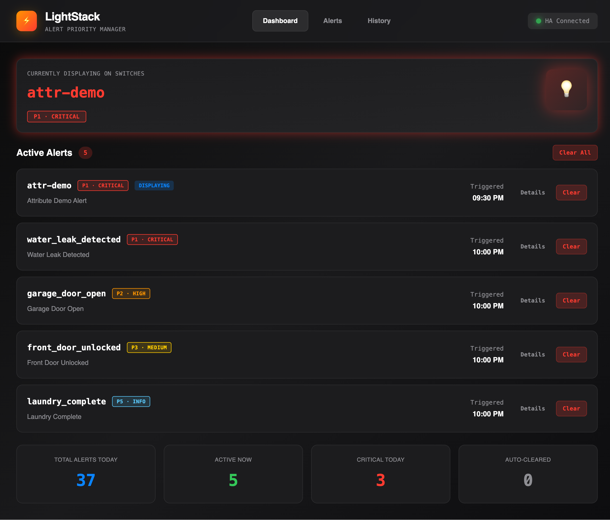
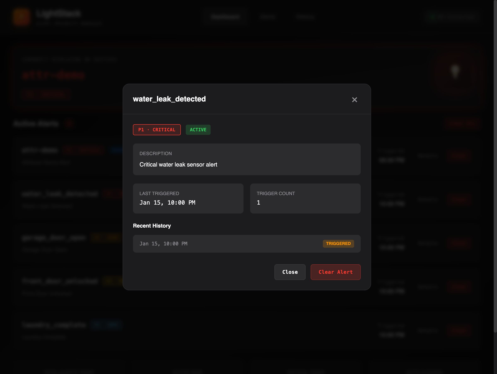
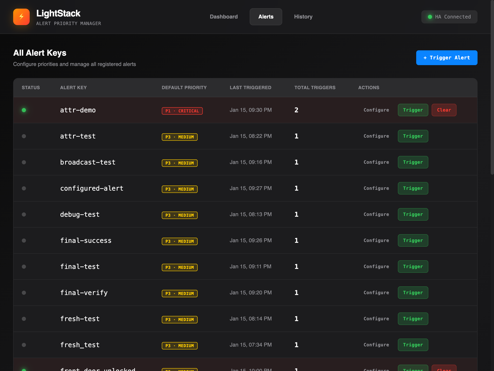
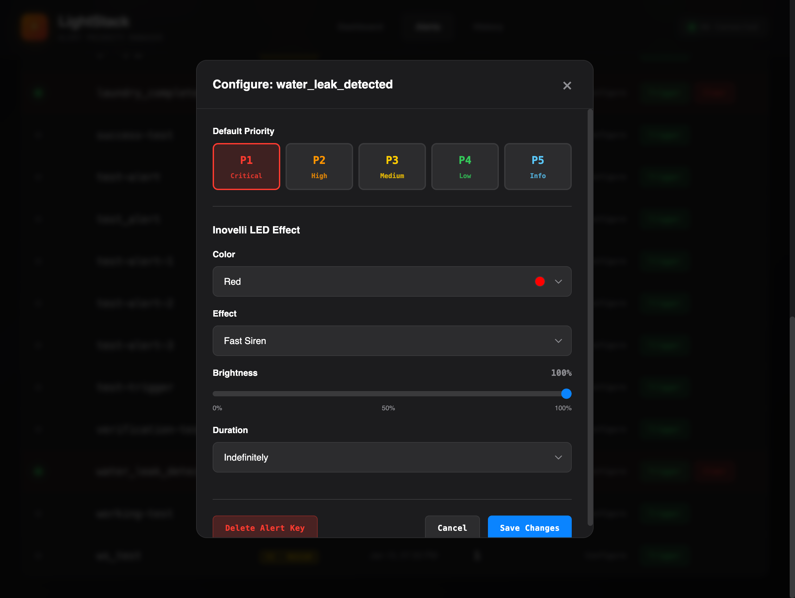
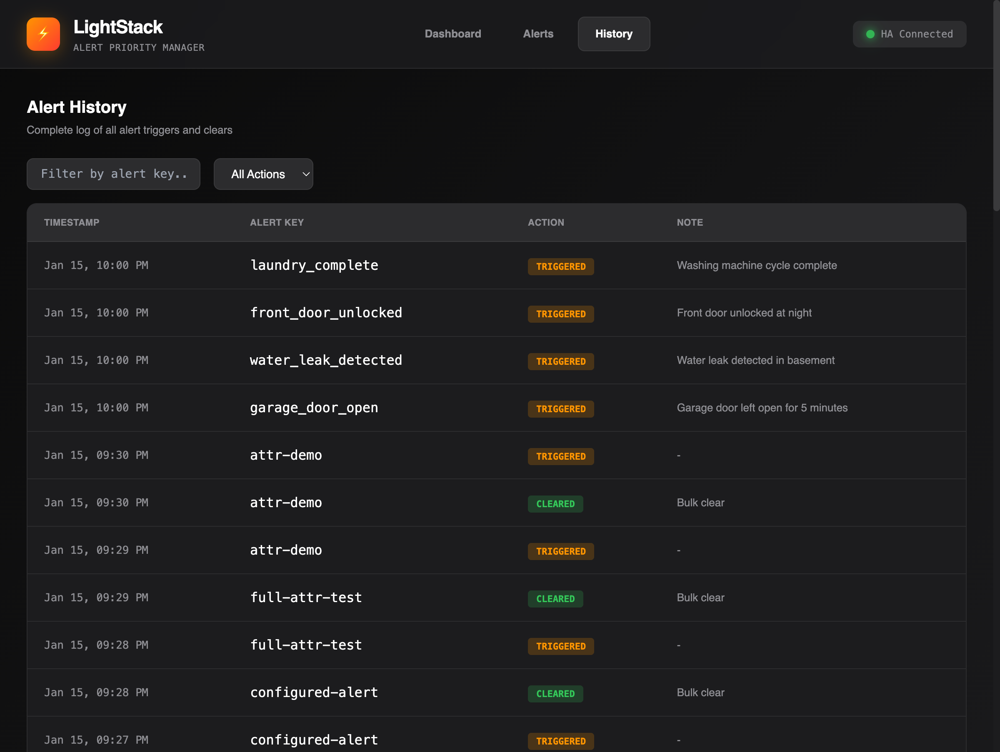

# LightStack

A priority-based alert management system for Home Assistant, designed specifically for Inovelli smart switches with notification LEDs.



## Overview

LightStack solves a common problem with Inovelli switch LED notifications: when multiple alerts are active, only one can be displayed at a time. Without proper state management, clearing one alert incorrectly shows "all clear" even when other alerts remain active.

**LightStack provides:**
- Centralized alert state tracking across all your automations
- Priority-based display ensuring critical alerts are always shown first
- Automatic state transitions when alerts clear
- Full LED customization per alert type (color, effect, brightness, duration)
- Real-time WebSocket updates for instant synchronization

## Home Assistant Integration

LightStack is designed to work with the **[LightStack Home Assistant Custom Integration](https://github.com/sjafferali/lightstack-homeassistant)**, available through HACS (Home Assistant Community Store).

The custom integration provides:
- Native Home Assistant services for triggering and clearing alerts
- Real-time WebSocket connection for instant LED updates
- Automatic sensor entities for current alert state
- Seamless integration with your existing automations

## The Problem

Inovelli switches feature an LED notification bar perfect for home automation alerts. However, managing multiple concurrent notifications is problematic:

```
Without LightStack:
  alert 1 fires   -> switch displays alert 1
  alert 2 fires   -> switch displays alert 2
  alert 2 clears  -> switch shows "all clear" (WRONG! alert 1 is still active)

With LightStack:
  alert 1 fires   -> switch displays alert 1
  alert 2 fires   -> switch displays alert 2 (if higher priority)
  alert 2 clears  -> switch displays alert 1 (correctly shows remaining alert)
```

## Features

### Dashboard
Real-time overview of your alert system status.


- **Currently Displaying**: Shows which alert is active on your Inovelli switches
- **Active Alerts**: List of all currently active alerts with priority and trigger time
- **Statistics**: Total alerts today, active count, critical alerts, and auto-cleared count
- **Quick Actions**: Clear individual alerts or view detailed history

### Alert Details
View detailed information about any alert including its history.



- Priority level and active status
- Description and last triggered time
- Trigger count statistics
- Recent history of triggers and clears

### Alert Configuration
Manage all registered alerts and their LED settings.



- View all registered alert keys
- See default priority and trigger statistics
- Manually trigger or clear alerts for testing
- Configure LED settings per alert

### LED Effect Configuration
Full control over Inovelli LED notification settings per alert.



- **Priority**: Set default priority (P1-Critical to P5-Info)
- **LED Color**: 12 color options (Red, Orange, Yellow, Green, Cyan, Teal, Blue, Purple, Pink, White, etc.)
- **LED Effect**: 20+ effects (Solid, Blink, Pulse, Chase, Aurora, Siren, Rising, Falling, etc.)
- **Brightness**: 0-100% control
- **Duration**: From 1 second to indefinite

### Alert History
Complete audit log of all alert activity with filtering.



- Paginated history of all triggers and clears
- Filter by alert key or action type
- View notes attached to each event
- Track patterns and troubleshoot automations

## Quick Start

### Docker Compose (Recommended)

```bash
# Clone the repository
git clone https://github.com/sjafferali/LightStack.git
cd LightStack

# Start LightStack
docker-compose up -d
```

The application will be available at:
- **Web UI**: http://localhost:8080
- **API Docs**: http://localhost:8080/api/docs

### Environment Variables

| Variable | Default | Description |
|----------|---------|-------------|
| `POSTGRES_PASSWORD` | `changeme` | PostgreSQL password |
| `SECRET_KEY` | - | Secret key for sessions |

## REST API Integration

### Trigger an Alert

```yaml
rest_command:
  lightstack_trigger:
    url: "http://lightstack:8080/api/v1/alerts/{{ alert_key }}/trigger"
    method: POST
    content_type: "application/json"
    payload: '{"note": "{{ note | default() }}", "priority": {{ priority | default(none) }}}'
```

### Clear an Alert

```yaml
rest_command:
  lightstack_clear:
    url: "http://lightstack:8080/api/v1/alerts/{{ alert_key }}/clear"
    method: POST
    content_type: "application/json"
    payload: '{"note": "{{ note | default() }}"}'
```

### Poll Current Display State

```yaml
rest:
  - resource: "http://lightstack:8080/api/v1/alerts/current"
    scan_interval: 5
    sensor:
      - name: "LightStack Current Alert"
        value_template: >
          {{ value_json.alert.alert_key if not value_json.is_all_clear else 'all_clear' }}
      - name: "LightStack Alert Priority"
        value_template: >
          {{ value_json.alert.effective_priority if not value_json.is_all_clear else 0 }}
```

### Example Automation

```yaml
automation:
  - alias: "Trigger LightStack Alert - Garage Door Open"
    trigger:
      - platform: state
        entity_id: binary_sensor.garage_door
        to: "on"
        for: "00:05:00"
    action:
      - service: rest_command.lightstack_trigger
        data:
          alert_key: garage_door_open
          note: "Garage door left open for 5 minutes"
          priority: 2

  - alias: "Clear LightStack Alert - Garage Door Closed"
    trigger:
      - platform: state
        entity_id: binary_sensor.garage_door
        to: "off"
    action:
      - service: rest_command.lightstack_clear
        data:
          alert_key: garage_door_open
```

## WebSocket API

LightStack provides a WebSocket endpoint for real-time updates at `/api/v1/ws`.

### Connection

```javascript
const ws = new WebSocket('ws://lightstack:8080/api/v1/ws');
```

### Client Commands

Send JSON messages to execute commands:

| Command | Data | Description |
|---------|------|-------------|
| `GET_STATE` | - | Get current alert state |
| `GET_ACTIVE_ALERTS` | - | List all active alerts |
| `GET_ALL_ALERTS` | - | List all registered alerts |
| `TRIGGER_ALERT` | `{alert_key, priority?, note?}` | Trigger an alert |
| `CLEAR_ALERT` | `{alert_key, note?}` | Clear an alert |
| `CLEAR_ALL_ALERTS` | `{note?}` | Clear all alerts |
| `PING` | - | Health check |

### Server Events

The server broadcasts these events to all connected clients:

| Event | Description |
|-------|-------------|
| `connection_established` | Initial connection with current state |
| `alert_triggered` | New alert activated |
| `alert_cleared` | Alert deactivated |
| `all_alerts_cleared` | Bulk clear operation |
| `current_alert_changed` | Highest priority alert changed |

## API Reference

| Endpoint | Method | Description |
|----------|--------|-------------|
| `/api/v1/alerts/current` | GET | Get currently displayed alert |
| `/api/v1/alerts/active` | GET | List all active alerts |
| `/api/v1/alerts` | GET | List all alerts (use `?active_only=true` to filter) |
| `/api/v1/alerts/{key}` | GET | Get specific alert state |
| `/api/v1/alerts/{key}/trigger` | POST | Trigger an alert |
| `/api/v1/alerts/{key}/clear` | POST | Clear an alert |
| `/api/v1/alerts/clear-all` | POST | Clear all alerts |
| `/api/v1/alert-configs` | GET | List all alert configurations |
| `/api/v1/alert-configs/{key}` | GET | Get specific configuration |
| `/api/v1/alert-configs/{key}` | PUT | Update configuration |
| `/api/v1/alert-configs/{key}` | DELETE | Delete configuration |
| `/api/v1/history` | GET | Get paginated history |
| `/api/v1/history/{key}` | GET | Get history for specific alert |
| `/api/v1/stats` | GET | Get dashboard statistics |

### Current Alert Response

```json
{
  "is_all_clear": false,
  "alert": {
    "id": 1,
    "alert_key": "water_leak_detected",
    "is_active": true,
    "priority": 1,
    "effective_priority": 1,
    "last_triggered_at": "2024-01-15T22:00:32Z",
    "config": {
      "name": "Water Leak Detected",
      "description": "Critical water leak sensor alert",
      "default_priority": 1,
      "led_color": 1,
      "led_effect": "fast_siren",
      "led_brightness": 100,
      "led_duration": 255
    }
  },
  "active_count": 3
}
```

## Priority Levels

| Priority | Label | Color | Use Case |
|----------|-------|-------|----------|
| 1 | Critical | Red | Security alerts, water leaks, smoke detection |
| 2 | High | Orange | Doors/windows left open, motion in restricted areas |
| 3 | Medium | Yellow | Default priority, general notifications |
| 4 | Low | Green | Appliance notifications, reminders |
| 5 | Info | Blue | Informational alerts, status updates |

## LED Effects

LightStack supports all Inovelli LED effects:

| Effect | Description |
|--------|-------------|
| Solid | Continuous solid color |
| Fast Blink | Rapid blinking |
| Slow Blink | Slow blinking |
| Pulse | Breathing/pulsing effect |
| Chase | LED chase pattern |
| Aurora | Aurora borealis effect |
| Siren | Police siren effect (fast/slow) |
| Rising/Falling | LEDs rise or fall (slow/medium/fast) |
| Open/Close | Opening and closing pattern |
| Small to Big | Expanding effect |

## Development

### Local Development with Docker

```bash
docker-compose -f docker-compose.dev.yml up
```

This starts:
- Backend with hot-reload at http://localhost:8000
- Frontend with HMR at http://localhost:5173
- PostgreSQL database
- Adminer at http://localhost:8081

### Local Development without Docker

**Backend:**
```bash
cd backend
poetry install
poetry run uvicorn app.main:app --reload --port 8000
```

**Frontend:**
```bash
cd frontend
npm install
npm run dev
```

### Running Tests

```bash
cd backend
poetry run pytest
```

## Tech Stack

- **Backend**: Python, FastAPI, SQLAlchemy, PostgreSQL/SQLite
- **Frontend**: React, TypeScript, Tailwind CSS, TanStack Query, Zustand
- **Real-time**: WebSocket with automatic reconnection
- **Infrastructure**: Docker, nginx

## Architecture

```
+-------------------+     +--------------------+     +-------------------+
|  Home Assistant   |---->|    LightStack      |<----|   Web UI          |
|  Automations      |     |    (FastAPI)       |     |   (React)         |
+-------------------+     +--------------------+     +-------------------+
                                 |
                                 v
                          +--------------------+
                          |   PostgreSQL       |
                          |   Database         |
                          +--------------------+
```

LightStack maintains a single source of truth for all alert states, ensuring consistent behavior across all connected clients and automations.

## License

MIT License
